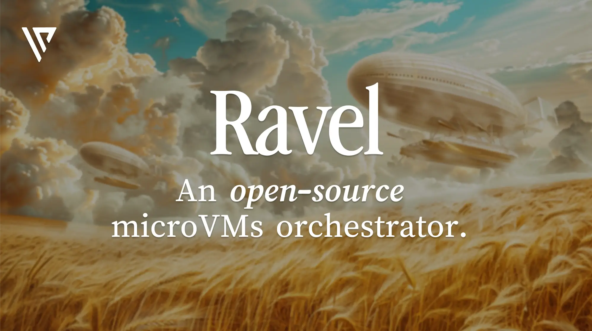

# Ravel

> Ravel is an open-source microVMs orchestrator.

<div align="center">
  <a href="https://discord.gg/DuW5uQCtZj">
    
  </a>

  <a href="https://x.com/intent/follow?screen_name=ValyentDev">
    
  </a>
</div>

<div align="center">
  <picture>
    
  </picture>
</div>

## Table of Contents

- [Technologies](#technologies)
- [Roadmap](#roadmap)
- [Features](#features)
- [Prerequisites](#prerequisites)
- [Documentation](#documentation)
- [FAQ](#faq)
- [License](#license)
- [Star History](#star-history)

## About

Ravel emerges as the building block for [Valyent](https://valyent.cloud)'s cloud services.

Ravel is a **bidding-style orchestrator** for _microVMs_. It allows you to create, manage, and destroy microVMs on the fly. It supports running OCI images inside microVMs powered by CloudHypervisor.

## Technologies

- [Go](https://golang.org/): A fast, efficient programming language designed for building scalable software.
- [Cloud Hypervisor](https://github.com/cloud-hypervisor/cloud-hypervisor): A lightweight virtual machine monitor for running modern cloud workloads.
- [NATS](https://nats.io/): A simple, high-performance messaging system for cloud applications and microservices.
- [Corrosion](https://github.com/superfly/corrosion): Gossip-based service discovery (and more) for large distributed systems.

## Features

- [x] Create, manage and destroy microVMs
- [x] RESTful API
- [x] Bidding-style orchestrator

## Prerequisites

- [Go 1.22](https://golang.org/dl/)
- [Cloud Hypervisor](https://github.com/cloud-hypervisor/cloud-hypervisor)
- [TUN kernel module](https://en.wikipedia.org/wiki/TUN/TAP) enabled
- [KVM](https://fr.wikipedia.org/wiki/Kernel-based_Virtual_Machine) enabled

## Documentation

For more details, please refer to our [documentation](https://docs.valyent.cloud).

### Installation

```bash
curl -L https://raw.githubusercontent.com/valyentdev/ravel/refs/heads/main/install.sh | bash
```

## FAQ

### Is it production-ready?

Not yet, Ravel is in **alpha** and is to be considered unstable.

But we are working full time on providing a stable release.

### Why is it named Ravel?

Ravel is named after the famous composer Maurice Ravel, known for his orchestral works.

### How do I contribute?

Please come and join us on our [Discord server](https://discord.valyent.cloud), where you can ask questions, get help, and contribute to the project.

### How do I report a bug?

Please open an issue on our [GitHub repository](https://github.com/valyentdev/ravel/issues).

### How do I request a feature?

Please open an issue on our [GitHub repository](https://github.com/valyentdev/ravel/issues).

## License

Copyright 2024 - Valyent

Licensed under the Apache License, Version 2.0 (the "License");
you may not use this file except in compliance with the License.
You may obtain a copy of the License at

[http://www.apache.org/licenses/LICENSE-2.0](http://www.apache.org/licenses/LICENSE-2.0)

Unless required by applicable law or agreed to in writing, software
distributed under the License is distributed on an "AS IS" BASIS,
WITHOUT WARRANTIES OR CONDITIONS OF ANY KIND, either express or implied.
See the License for the specific language governing permissions and
limitations under the License.

## Star History

Thank you for your support! 🌟

[](https://star-history.com/#valyentdev/ravel&Date)
